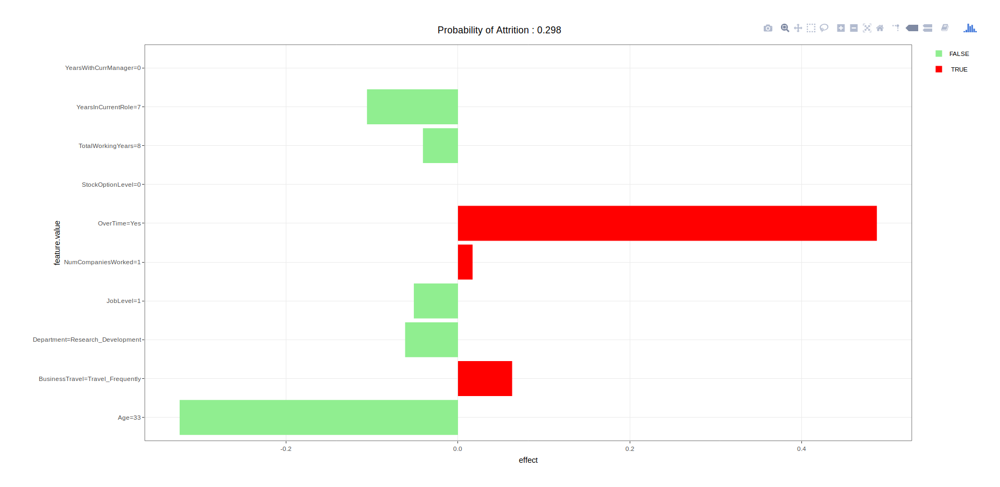

# Introduction

This is a demo on how to use `plumber` to deploy a machine learning model as an API service
to do risk scoring on new data.

We will train a Random Forest model to predict the risk of employee attrition. We will also build a secondary LIME model on top of the prediction model to help explain which were the variables that 
contributed to a high / low attrition risk score on an individual-record basis.

# Starting the API service

Open up a terminal. In your command line, type:

```
Rscript scripts/api/entrypoint.R 
```

# API Endpoints

## `/predict`

Reads in a json input feature vector representing characteristics of an employee (sample found in `objects/testinput.json`) and outputs the computed risk score, as well as the top influencing variables from LIME.


Open up another terminal. In your command line, type:

```
curl --data @objects/testinput.json localhost:8000/predict | json_reformat > objects/testoutput.json
```

This will make a `POST` request to `/predict` with input data from `objects/testinput.json`,
format / prettify the corresponding model output, and writes the results to the output file
`objects/testoutput.json`.


### Sample input json file

```
{
    "Age": 33,
    "BusinessTravel": "Travel_Frequently",
    "DailyRate": 1392,
    "Department": "Research_Development",
    "DistanceFromHome": 3,
    "Education": "Master",
    "EducationField": "Life_Sciences",
    "EnvironmentSatisfaction": "Very_High",
    "Gender": "Female",
    "HourlyRate": 56,
    "JobInvolvement": "High",
    "JobLevel": 1,
    "JobRole": "Research_Scientist",
    "JobSatisfaction": "High",
    "MaritalStatus": "Married",
    "MonthlyIncome": 2909,
    "MonthlyRate": 23159,
    "NumCompaniesWorked": 1,
    "OverTime": "Yes",
    "PercentSalaryHike": 11,
    "PerformanceRating": "Excellent",
    "RelationshipSatisfaction": "High",
    "StockOptionLevel": 0,
    "TotalWorkingYears": 8,
    "TrainingTimesLastYear": 3,
    "WorkLifeBalance": "Better",
    "YearsAtCompany": 8,
    "YearsInCurrentRole": 7,
    "YearsSinceLastPromotion": 3,
    "YearsWithCurrManager": 0
  }
```

### Sample output

```
{
    "risk_score": [
        {
            "Yes": 0.298,
            "No": 0.702
        }
    ],
    "lime_features": [
        {
            "beta": -0.0031,
            "x.recoded": 33,
            "effect": -0.1023,
            "x.original": "33",
            "feature": "Age",
            "feature.value": "Age=33",
            ".class": "Yes"
        },
        {
            "beta": 0.3359,
            "x.recoded": 1,
            "effect": 0.3359,
            "x.original": "Yes",
            "feature": "OverTime=Yes",
            "feature.value": "OverTime=Yes",
            ".class": "Yes"
        },
        {
            "beta": -0.0065,
            "x.recoded": 0,
            "effect": -0,
            "x.original": "0",
            "feature": "StockOptionLevel",
            "feature.value": "StockOptionLevel=0",
            ".class": "Yes"
        },
        {
            "beta": -0.0059,
            "x.recoded": 8,
            "effect": -0.0475,
            "x.original": "8",
            "feature": "TotalWorkingYears",
            "feature.value": "TotalWorkingYears=8",
            ".class": "Yes"
        },
        {
            "beta": -0.0029,
            "x.recoded": 7,
            "effect": -0.0202,
            "x.original": "7",
            "feature": "YearsInCurrentRole",
            "feature.value": "YearsInCurrentRole=7",
            ".class": "Yes"
        }
    ]
}

```

## `/lime/<k>`

Reads in a json input feature vector representing characteristics of an employee (sample found in `objects/testinput.json`) and generates a `html` LIME report containing the attrition risk score,
as well as the top `k` variables identified by LIME that influenced the risk score.

For example, to generate a LIME report for the top 10 (k=10) variables:

`curl --data @objects/testinput.json localhost:8000/lime/10 > objects/lime-report.html`

This will generate the LIME report in html format and the output will be written to `objects/lime-report.html`.

### Sample LIME Report



# References

The example in this repo is an adaptation of the following blog post: [Understand Employee Churn Using H2O Machine Learning and LIME](https://www.business-science.io/business/2018/06/25/lime-local-feature-interpretation.html).